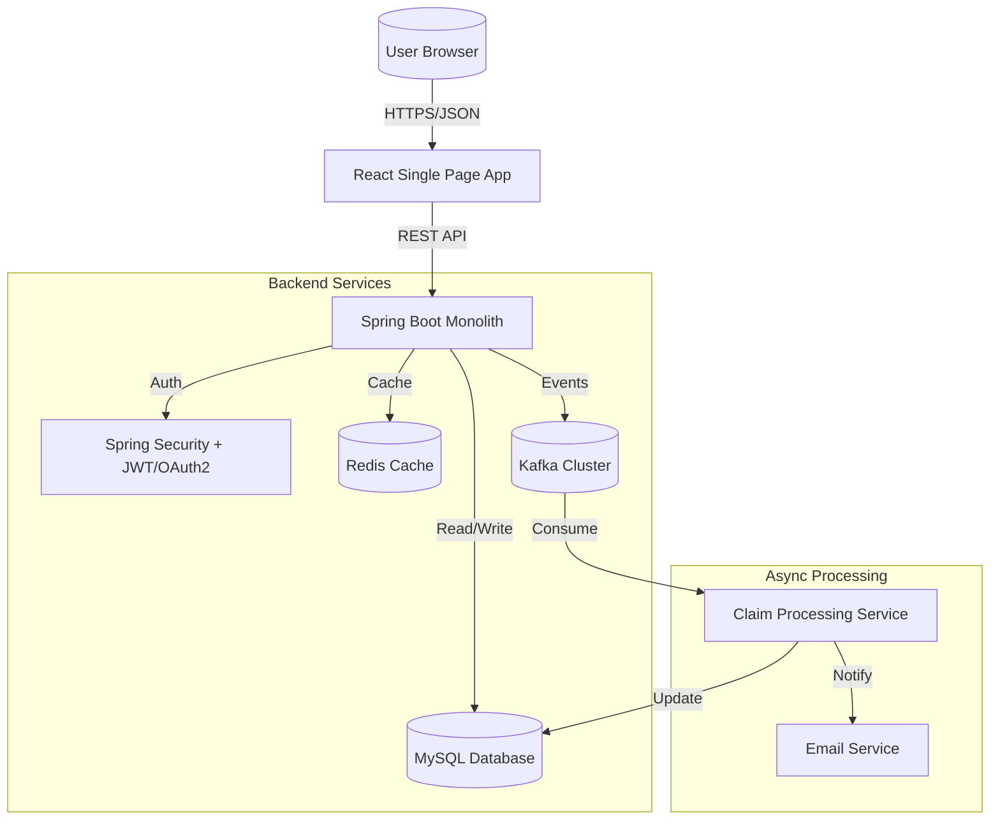

# Claims Processing System - Technical Design Document

## 1. High-Level Architecture

The system follows a modern monolithic architecture with a clear separation between the frontend and backend, leveraging micro-components (Redis, Kafka) for scalability and performance.



### Components
- **Frontend**: React.js application serving the UI.
- **Backend**: Spring Boot 3.3.0 monolithic application.
- **Database**: MySQL 8.0 for persistent storage.
- **Caching**: Redis for session storage and frequently accessed reference data.
- **Messaging**: Apache Kafka for asynchronous claim processing and decoupling.
- **Logging**: Log4j2 for structured asynchronous logging.

---

## 2. Backend Package Structure

The backend code is organized by layer/feature within the `com.claim.demo` package.

```
com.claim.demo
├── config          # Configuration classes (Security, Kafka, Redis, Swagger)
├── controller      # REST Controllers (API Layer)
├── dto             # Data Transfer Objects (Request/Response models)
├── entity          # JPA Entities (Database mapping)
├── filter          # Security filters (JWT Token validation)
├── repository      # Spring Data JPA Repositories
└── service         # Business Logic Layer
```

### Key Considerations
- **Controller**: Handles HTTP requests, input validation, and maps DTOs.
- **Service**: Contains business rules, orchestration of repositories, and Kafka publishing.
- **Repository**: Data access layer extending `JpaRepository`.
- **DTO**: Decouples API contract from database schema.

---

## 3. Database Schema (SQL)

The schema is designed for relational consistency using MySQL.

```sql
CREATE DATABASE IF NOT EXISTS claim_db;
USE claim_db;

-- Users Table
CREATE TABLE users (
    id BIGINT AUTO_INCREMENT PRIMARY KEY,
    username VARCHAR(50) NOT NULL UNIQUE,
    email VARCHAR(100) NOT NULL UNIQUE,
    password_hash VARCHAR(255) NOT NULL,
    role VARCHAR(20) DEFAULT 'USER',
    created_at TIMESTAMP DEFAULT CURRENT_TIMESTAMP
);

-- Claims Table
CREATE TABLE claims (
    id BIGINT AUTO_INCREMENT PRIMARY KEY,
    claim_id VARCHAR(36) NOT NULL UNIQUE, -- UUID
    user_id BIGINT NOT NULL,
    policy_number VARCHAR(50) NOT NULL,
    amount DECIMAL(15, 2) NOT NULL,
    description TEXT,
    status VARCHAR(20) DEFAULT 'SUBMITTED', -- SUBMITTED, PROCESSING, APPROVED, REJECTED
    filed_date TIMESTAMP DEFAULT CURRENT_TIMESTAMP,
    last_updated TIMESTAMP DEFAULT CURRENT_TIMESTAMP ON UPDATE CURRENT_TIMESTAMP,
    FOREIGN KEY (user_id) REFERENCES users(id)
);

-- Notifications Table
CREATE TABLE notifications (
    id BIGINT AUTO_INCREMENT PRIMARY KEY,
    user_id BIGINT NOT NULL,
    message TEXT NOT NULL,
    is_read BOOLEAN DEFAULT FALSE,
    sent_at TIMESTAMP DEFAULT CURRENT_TIMESTAMP,
    FOREIGN KEY (user_id) REFERENCES users(id)
);

-- Claims Summary / Reports Table (Analytical)
CREATE TABLE claim_reports (
    id BIGINT AUTO_INCREMENT PRIMARY KEY,
    report_date DATE NOT NULL,
    total_claims INT DEFAULT 0,
    total_amount DECIMAL(20, 2) DEFAULT 0.00,
    approved_count INT DEFAULT 0
);
```

---

## 4. API Contracts

All APIs consume and produce `application/json`.
Base URL: `/api/v1`

### Authentication
- **POST** `/auth/login`
    - Request: `{"username": "agent1", "password": "password123"}`
    - Response: `{"token": "eyJhbGciOiJIUzI1...", "type": "Bearer", "expires_in": 3600}`
- **POST** `/auth/register`
    - Request: `{"username": "newuser", "email": "user@example.com", "password": "securepass"}`
    - Response: `{"message": "User registered successfully"}`

### Claims (`ClaimsController`)
- **GET** `/claims` (Headers: `Authorization: Bearer <token>`)
    - Response: `[{"claimId": "c-123", "amount": 5000.0, "status": "APPROVED", ...}]`
- **POST** `/claims`
    - Request: `{"policyNumber": "POL-999", "amount": 1200.50, "description": "Car accident"}`
    - Response: `{"claimId": "uuid-gen", "status": "SUBMITTED", "message": "Claim queued for processing"}`
- **GET** `/claims/{id}`
    - Response: `{"claimId": "...", "status": "..."}`
- **PUT** `/claims/{id}/status` (Admin only)
    - Request: `{"status": "APPROVED", "remarks": "Valid documents"}`

### Users (`UsersController`)
- **GET** `/users/profile`
    - Response: `{"username": "agent1", "email": "agent1@test.com", "roles": ["USER"]}`

---

## 5. Execution Flow

### Scenario: End-to-End Claim Processing

1.  **Login**: User logs in via React UI -> `POST /auth/login`. Server validates credentials, generates **JWT**, saves session in **Redis** (optional), and returns token.
2.  **Submission**: User fills claim form -> `POST /claims`.
3.  **Validation**: REST Controller validates input (e.g., amount > 0).
4.  **Persistence**: `ClaimService` saves initial claim with status `SUBMITTED` to MySQL.
5.  **Event Generation**: `ClaimService` publishes `ClaimCreatedEvent` to **Kafka** topic `claim-updates`.
6.  **Async Processing**:
    - A Kafka Listener in `NotificationService` consumes the event.
    - Triggers an email confirmation via SMTP.
    - Creates an in-app `Notification` record in MySQL.
7.  **Status Update**: Admin reviews and updates status -> `PUT /claims/{id}/status`.
8.  **Reporting**: A scheduled job or trigger aggregates data into `claim_reports` table for the dashboard.
9.  **Feedback**: User sees status update via polling or re-fetching `/claims` list.

---

## 6. Cloud vs Local Setup

### Local Environment (Docker Compose)
Runs everything on a single developer machine.

**`docker-compose.yml` Configuration:**
-   **app-backend**: Builds from `.` (Spring Boot), Ports: `8080:8080`. Env: `SPRING_PROFILES_ACTIVE=dev`.
-   **app-frontend**: Builds from `./frontend` (React), Ports: `3000:3000`.
-   **mysql**: Image: `mysql:8.0`, Ports: `3306:3306`.
-   **redis**: Image: `redis:alpine`, Ports: `6379:6379`.
-   **zookeeper**: Image: `confluentinc/cp-zookeeper:latest`.
-   **kafka**: Image: `confluentinc/cp-kafka:latest`, Ports: `9092:9092`. Depends on Zookeeper.

### Cloud Environment (Production - AWS Example)
Decoupled and managed services for high availability.

| Component | AWS Service | Reasoning |
| :--- | :--- | :--- |
| **Frontend** | S3 + CloudFront | Static hosting, global CDN, low cost. |
| **Backend** | AWS ECS (Fargate) | Serverless containers, auto-scaling. |
| **Database** | Amazon RDS (MySQL) | Managed backups, patching, Multi-AZ. |
| **Cache** | Amazon ElastiCache (Redis) | Managed Redis cluster for speed. |
| **Messaging** | Amazon MSK | Managed Kafka for event streaming reliability. |
| **Logging** | CloudWatch | Centralized logging and monitoring. |
| **Secrets** | AWS Secrets Manager | Secure storage for DB credentials and API keys. |
